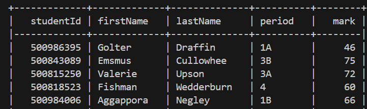
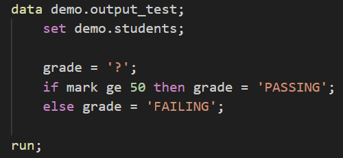

author: Inspark Analytics
id: understanding_snowpark_dataframes_as_a_sas_user_guide
summary: This guide overviews SAS Data Step fundamentals, how Snowpark Dataframes work, and how Snowpark can replicate a SAS Data Step via Python
categories: Getting-Started, Educational
environments: web
status: Published 
feedback link: https://github.com/Snowflake-Labs/sfguides/issues
tags: Getting Started, Educational, SAS

# Understanding Snowpark Dataframes as a SAS User Guide

## Overview
Duration: 2

<!-- In this guide, we will be going over a few selected topics to make comparions in both similarity and dissimilarity towards each other. There will be a brief overview of SAS, and the fundamentals of how the Data Step works, a topic about how Snowflake works and how Snowpark Dataframes operate, concluding with an example of how Snowpark is able to replicate a SAS Data Step via the Snowpark's Python API Library. Topics discussed will be extremely brief, and will only skim the surface of what Snowflake can do, feel free to do extended research on what there is to offer afterwards.  -->

In this guide, we’ll explore a few key topics, comparing and contrasting them to highlight both similarities and differences. We’ll start with a quick overview of SAS and the fundamental phases of the Data Step. Then we will cover how Snowflake works, including how Snowpark DataFrames operate within it. To conclude, we will go over an example SAS Data Step and how Snowpark is able to replicate it's behaviour using Snowpark's Python API Library.

Please note that this guide will provide a high-level introduction to these topics, touching on the essentials and skimming the surface of what Snowflake has to offer. For those looking to dive deeper into the platform’s full capabilities, I encourage you to explore further and conduct your own research afterward.

### What you will build

REALISTICALLY WHAT DO I WRITE HERE

### What you will learn

- **SAS Data Step Overview**
    - Key elements of a Data Step
- **Overview of Snowpark**
    - What is Snowpark
    - Understanding Snowpark DataFrames
    - How to create Snowpark DataFrames
- **Comparing Snowpark's Python API and SAS Statements**
    - Illustrating SAS Data Step examples to compare with Snowpark's Python API
    - Exploring how Snowpark can replicate SAS functionality

### Prerequisite

REALISTICALLY WHAT DO I WRITE HERE

### Additional Information

<!-- As mentioned above, this guide will only **briefly** go over simple/commonly used Snowpark functions. It is best to do extended research with the official documentation for a better understanding. The Snowpark API Library is currently (as of writing this) available in three languages, Java, Scala, and what we will be using, Python. For more information, head over to the [Developer Guides on the Snowpark API documentation](https://docs.snowflake.com/en/developer-guide/snowpark/index#developer-guides). -->

As mentioned earlier, this guide will provide a **brief** overview of basic and commonly used Snowpark functions. For a deeper understanding, it's recommended to consult the official documentation. The Snowpark API Library is currently available in three languages: Java, Scala, and Python (which we will be using). For more detailed information, check out the [Developer Guides on the Snowpark API documentation](https://docs.snowflake.com/en/developer-guide/snowpark/index#developer-guides).

## SAS Overview (Optional)
Duration: 5

Although you may already know about all there is to Data Steps, we'll quickly review them as a refresher to make comparisons easier later in this Quickstart. If you feel that there is no need to review Data Steps, proceed to the next step.

### Data Step Overview

A basic SAS Data Step will be comprised of the following workflow...

- Compilation Phase
    - Syntax Checking and Compilation
    - Creates an Input Buffer, Program Data Vector (PDV), and dataset Descriptor Information
    - If at any point during the compilation macros are detected, the macro processor will take over to resolve it. It will check both global and local symbol tables for any defined macros, and will translate them accordingly.
- Execution Phase
    - During the Execution Phase, SAS will the read the program in iterations, per observation. 
        1. As data is read through the input buffer, it will write it to the PDV under the assigned variable. 
        2. As the Data Step continues, values in the PDV will be added or manipulated based on statements in the program.
        3. At the end of the data step block, SAS will do the following…
            - Write the PDV to the output dataset, if there is more data to read, set the internal program counter back to the start of the Data Step in the next iteration, and reset the PDV for all non-retained values
        4. Execution will continue to loop through the Data Step until no more observations are read

## Snowpark Overview
Duration: 5

Now we will be discussing how Snowpark itself, and the general information regarding how it, stores data in Dataframes. Refer to the [Dataframe in Snowpark Python](https://docs.snowflake.com/en/developer-guide/snowpark/python/working-with-dataframes) for more information on this topic.

### What's a Dataframe?

<!-- Similar to tables, dataframes are a data structure that is comprised of columns and rows of data. More often than not, your tabular datasets will look no different as a dataframe. -->

A DataFrame, similar to tables, is a data structure similar to a dataset, with rows and columns. Just like a SAS dataset, a DataFrame holds data in a tabular format where each column represents a variable and each row represents an observation. You’ll find that your tabular datasets will look no different as a Dataframe, with labeled columns and indexed rows.

### What makes a Snowpark Dataframe so different?

<!-- Snowpark Dataframes, being a relational dataset, contain a collection of Row objects given a schema, which is strictly lazy-evaluated. To give a proper answer on why Snowpark Dataframes are lazily evaluated, we must understand how the Snowpark API is built underneath. -->

Snowpark DataFrames are a type of relational dataset that consists of rows organized according to a specific structure, called a schema. What seperates Snowpark Dataframes apart is that...

1. They operate directly with Snowflake's Data Warehouse (self-explanatory naming)
2. They are strictly lazily evaluated

To fully understand why Snowpark DataFrames are lazily evaluated and what it means, we must understand how the Snowpark API is designed and how it processes these operations.

### What is Snowpark?

<!-- Snowpark, fundamentally, is a wrapper for Snowflake's SQL engine. Being built upon the SQL API, it allows the user to write transformative or control-based instructions in a high-level programming language such as Java, Python, or Scala, and translates them to equivalent SQL code using an SQL Planner. The SQL Planner is a collection of highly optimized SQL instructions which reproduce the original API instruction's objectives. 

As such, the SQL Planner is only executed when data need to be brought to memory via specific actions/triggers; This allows the planner to be lazily evaluated, only needing to be executed when data is required to be loaded into memory for evaluation. If data is not needed to be in memory, then it does not need evaluation. This means SQL instructions are evaluated as late as possible in the pipeline as a result of batching several instructions into one, greatly reducing the data transfer load onto the server and increasing the optimization of large datasets. -->


Snowpark, fundamentally, is a high-level interface that acts as a wrapper for Snowflake’s SQL engine. Built on top of the SQL API, it allows users to write transformative or control-based operations in programming languages such as Java, Python, or Scala. These instructions are then automatically translated into corresponding SQL code through an SQL Planner. 

The SQL Planner contains a set of highly optimized SQL instructions that aim to achieve the same goals as the original API calls. Importantly, the planner only gets executed when necessary, specifically when data must be loaded into memory for further evaluation. This means that Snowpark takes advantage of lazy evaluation, where SQL instructions are only computed when required by specific actions or triggers, minimizing unnecessary processing. If data doesn’t need to be in memory, no SQL evaluation occurs.

This approach allows for more efficient processing. By batching multiple instructions into a single execution plan, Snowpark reduces the load on the server and optimizes data transfer, making it particularly effective for large datasets. This deferred evaluation ensures that computations are done as late as possible in the pipeline, enhancing overall performance and scalability.

### How to get around Lazy Evaluation?

Since Snowpark Dataframes are lazily evaluated, the data processing does not occur until a specific function triggers it. There are several functions in the Snowpark API designed to invoke the evaluation, however, the following four functions are amongst the more frequently used due to their simplistic or intrinsic behaviour.

To work around the innate nature of lazy evaluation in Snowpark Dataframes, you will need a trigger action or function to put data in memory. There are a few operations of doing evaluation, but one of the most common method is to use a trigger function explicitly. Out of the many functions, there are four functions that are more commonly used than others, due to their simplistic functionality and desired behaviour.

```python
# DataFrame functions
# The following functions do not necessarily have any major impact on the work flow (besides evaluation of the DataFrame), as the product of each function only provide some form of metric of data about the DataFrame itself.

DataFrame.collect() 
# Retrieves the dataset as a list of Row objects. Typically used for processing or visualizing the result of all prior transformations, being able to iterate between all rows.

DataFrame.count() 
# Returns the total row count of the dataset. Generally used to quickly determine for correct filtering or aggregation transformations applied on a DataFrame.

DataFrame.show() 
# Prints a preview of the dataset table in a tabular format in the console. Mainly used for data exploration or debugging, being able to visually see quickly for correct transformations applied to the DataFrame.

# DataFrameWriter function
# The following function does have an impact on the entire workflow, as it involves saving the current data in the DataFrame to a specified destination, which may or may not be desired if DataFrame evaluation is only needed.

DataFrameWriter.save_as_table() 
# This function writes the dataset to a table at a specified location. In combination with DataFrame.write, which returns a DataFrameWriter object for the current DataFrame, the function triggers the evaluation and finalization of the DataFrame transformation. Once the evaluation is complete, the data is written to the target location. While DataFrame.write is used to access the DataFrameWriter, it is the DataFrameWriter.save_as_table() function that actually performs the evaluation and saves the DataFrame to the designated table.
```

For more examples on performing evaluations on dataframes you can refer to this section of for [evaluating dataframes](https://docs.snowflake.com/en/developer-guide/snowpark/python/working-with-dataframes#performing-an-action-to-evaluate-a-dataframe).

### How to create Snowpark Dataframes with existing data?

<!-- To use data inside of a dataframe, the data must be placed such that the Session object is able to access it. The Session object is mainly used to connect to the Snowflake databases to access data. This means that the data must either be in an already existing table, or for other data file types, must be stored in a Snowflake Stage, to which the DataFrameReader class is able to interact with it. To learn more ways of construction dataframes, refer to the documentation for [dataframe construction](https://docs.snowflake.com/en/developer-guide/snowpark/python/working-with-dataframes#label-snowpark-python-dataframe-construct). -->

To creating Snowpark Dataframes, there are some steps needed to use existing data. To directly interact with Snowflake's Data Warehouse, a Snowflake Connection must be established to be able to read or write to anything. This is done by the use of the Session object, able to connect to any specified Snowflake Database to access the data. The Session object must be configured, needing credentials and database specifications (optional), which set-up examples are shown in the [Creating a Session](https://docs.snowflake.com/en/developer-guide/snowpark/python/creating-session) step on the documentation.

Now that we've established a connection to the Snowflake Database, we can now create a Snowpark Dataframe with existing data. Since we're connected to the Snowflake databases, the existing data must exist within the database (meaning the data must have been uploaded/moved/transfered prior). From here, there are a multitude of ways to creating a Snowpark Dataframe, primarily through the use of the Session objects functions to directly create a dataframe, more on [dataframe creation](https://docs.snowflake.com/en/developer-guide/snowpark/python/working-with-dataframes#label-snowpark-python-dataframe-construct) here.


## Using a Dataframe in a SAS Data Step
Duration: 10

Now that we know a little more about how a Snowpark Dataframe operates, we can learn about how Python’s library of Snowpark can simulate similar SAS statements in a Data Step. There are many other functions that Snowpark has to offer, so this will just be the tip of the iceberg on what Snowpark can do in place of SAS. This will be a very basic data step to keep things simple.

### Example Data Step

#### Prerequisite Information

As a prerequisite, this data step will have access to and is reading the dataset *students*, with the following schema...

The dataset students has 5 columns...
- studentId
- firstName
- lastName
- period
- mark

*firstName* and *lastName* have a string data type whilst *studentId*, *period*, and *mark* have a numerical data type.



#### The Data Step

The Data Step will write to *output_test*. It first reads (as it has access to) the dataset *students* and sets a new column called *grade*, which has the value of *?*. It will then check if a students *mark* is greater than or equal to 50 or not, setting their *grade* to either *PASSING* or *FAILING* respectively.



### How to handle these situations in Python using Snowpark's Library

We will now go over how we would be able to replicate the same behaviours/functions as SAS using Python's Snowpark Library.

#### *set demo.students*

SAS Set Statement; Reads data from a location *demo.students*.

In Snowpark, this is essentially the creation of a DataFrame with the desired data to be read from. This was explained in the Snowpark Overview, *How to create Snowpark Dataframes with existing data?*, but to recap, you would first need to establish connection to Snowpark database via a Session object, then to read in the data from that table into a DataFrame.
- For more details, you can either refer to generalized documentation for [constructing dataframes](https://docs.snowflake.com/en/developer-guide/snowpark/python/working-with-dataframes#constructing-a-dataframe), or referring to the [DataFrameWriter API](https://docs.snowflake.com/en/developer-guide/snowpark/reference/python/1.26.0/snowpark/api/snowflake.snowpark.DataFrameReader) for examples of reading different from different data sources

#### *grade = '?'*

SAS Assignment Statement; Assigns a new column (or already existing column’s value), *grade* with the string value *?*.

In Snowpark, we can use the DataFrame function *withColumn* to, like SAS, add a column (or change an existing column’s value) with a new value, which will be *?*.
- [DataFrame.withColumn documentation](https://docs.snowflake.com/en/developer-guide/snowpark/reference/python/1.6.1/api/snowflake.snowpark.DataFrame.withColumn)
- There are also other functions for editing columns, such as renaming or adding/changing existing columns in a singular function (since *DataFrame.withColumn* is only able to take in one Data Frame).
    - [DataFrame.withColumnRenamed documentation](https://docs.snowflake.com/en/developer-guide/snowpark/reference/python/1.6.1/api/snowflake.snowpark.DataFrame.withColumnRenamed)
    - [DataFrame.with_columns documentation](https://docs.snowflake.com/en/developer-guide/snowpark/reference/python/1.6.1/api/snowflake.snowpark.DataFrame.with_columns)

#### *if mark ge 50 then grade = 'PASSING'; ELSE grade = 'FAILING';*

SAS If-Then/Else Statement; Checks for the expression *mark ge 50*, then executing the statement *grade='PASSING'* if the expression is true, ELSE it will execute the statement *grade='FAILING'*.

In Snowpark, we can use the DataFrame function *when*, in conjunction with the optional otherwise function. Similar to the IF/THEN Statement, *when* will evaluate a condition then execute it’s appropriate statement when true. The optional *otherwise* function, similar to how the ELSE statement works, is only available in functions/statements similar to a conditional, which will default to value when no conditions are true.
- [functions.when documentation](https://docs.snowflake.com/en/developer-guide/snowpark/reference/python/1.6.1/api/snowflake.snowpark.functions.when)

#### Saving the output data

In SAS, the PDV gets written to the output data set, saving the data incrementally. 

In Snowpark, there are a few ways of saving data, but the most common way is utilizing these following functions...

1. Converting the DataFrame object into a DataFrameWriter object using the *DataFrame.write* function
    - The beginning step to saving your data is by calling *DataFrame.write* on the specified dataframe to convert it to a DataFrameWriter object. DataFrameWriter objects are given the capability to write DataFrame objects to output destinations, providing various options on how data is saved.
    - [DataFrame.write function documentation](https://docs.snowflake.com/developer-guide/snowpark/reference/python/latest/snowpark/api/snowflake.snowpark.DataFrame.write#snowflake.snowpark.DataFrame.write)
2. Setting one of various saving options by using the *DataFrameWriter.mode()* function
    - By default, the writing mode is set to *errorifexists*, which will throw an exception error if data exists at that specified location. Depending on how you want the data to be handled when writing to the destination, this might not always be the desired outcome. Of the given modes, *overwrite* is the more common mode, as it will essentially replace the table by dropping the destination's table prior to saving the new data (overwriting the data).
    - [DataFrameWriter.mode function documentation](https://docs.snowflake.com/developer-guide/snowpark/reference/python/latest/snowpark/api/snowflake.snowpark.DataFrameWriter.mode#snowflake.snowpark.DataFrameWriter.mode)
3. Utilizing the *DataFrameWriter.save_as_table()* function to save the data to the specified table
    - After the desired writing configuration, the last step is saving the data to the specified table. This can be done using the DataFrameWriter objects function, *save_as_table()*, which takes in the destination table's name.
    - We've ommitted other parameters that this function can do, but for a more in-depth look, refer to the [DataFrameWriter.save_as_table function documentation](https://docs.snowflake.com/en/developer-guide/snowpark/reference/python/latest/snowpark/api/snowflake.snowpark.DataFrameWriter.save_as_table)

In short, a very basic coding line would look something like...

```python
dataframe_name.write.mode("overwrite").save_as_table("table_name")
```

- We have an existing DataFrame *dataframe_name* with some data saved in it. 
- Function *.write* converts it from a DataFrame object to a DataFrameWriter object so that it is able to write to a table
- Function *.mode("overwrite")* sets the writing mode to overwrite, which will essentially save our new data over any old data when writing to the table
- Function *.save_as_table("table_name")* will then write our DataFrame *dataframe_name* to the table *table_name*, where it will overwrite any pre-existing data

## Conclusion and Resources
Duration: 3

### Conclusion

<!-- As you've seen, Snowflake has many similar functionalities that are very familiar to SAS. Although it is not a 1-to-1 exact replica, Snowflake still has the capabilities of providing comparable if not exact behaviours and functions akin to SAS. -->

Throughout this quickstart, we've covered a couple of points to get more familiar with Snowpark as a SAS user, using Snowpark's Python API. We've briefly covered a summary of SAS Data Steps as a refresher, went over how Snowflake works and it's articulations and how Snowpark Dataframes operates, as well as comparing behaviours of Data Steps using Snowpark's Python API library.

Although Snowflake isn't a 1-to-1 replica of SAS, it possesses the capability of providing comparable if not exact behaviours and functions akin to SAS, being able to mimic the functions of a Data Step. It's important to point out that this quickstart only covers Snowpark's Python API Library, as the API Library is also available in Java and Scala.


### What You Learned

- Recap on SAS Data Steps
- What Snowflake is and how it operates
- What Snowpark dataframes are, and how to operate them
- Some of many Snowflake functions via Python
- Some similarities between SAS and Snowflake

### Resources

The resources listed here are the overarching/generalized documentation referenced in this quickstart. All references cited throughout stem from one of the following documentations below, so feel free to explore upon more topics if needed.

- [Central Snowpark's API library documentation](https://docs.snowflake.com/en/developer-guide/snowpark/index)
- [Snowpark's Python Dataframe outline documentation](https://docs.snowflake.com/en/developer-guide/snowpark/python/working-with-dataframes)
- [Snowpark's Python API reference documentation](https://docs.snowflake.com/en/developer-guide/snowpark/reference/python/1.28.0/index)